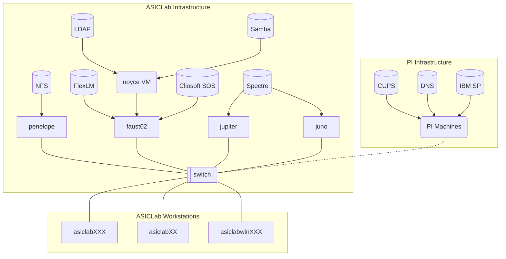

## Overview

The documentation covers ASICLab software, servers, workstations, and other infrastructure. The scope of this document is information that a user with basic familiarity with Linux systems would need to fix problems with existing systems or add new systems to the network. Therefore, extensive documentation of general Linux knowledge should be avoided to avoid diluting the usefulness of information.

## Network Architecture

The follow diagram shows the various workstations and servers (i.e. infrastructure used in the lab, and the major services that run on the servers like NFS and LDAP. Additionally, some useful services like DNS and CUPS are inherited from the larger PI network, as seen on the right.

## List of Machines and their Purpose

`asiclab###`: User Workstations

`aisclabwin###`: User Windows Machines

`penelope`: NFS, LDAP, License Servers

`jupiter`: Simulation server

`juno`: Simulation server (identical configuration of jupiter)

`faust02`: (soon to be decommissioned, still running LDAP and License Server)

`apollo`: (retired)

`asiclab##`: Retired user workstations, still good for less demanding work. Easily configured for Linux or Windows.
