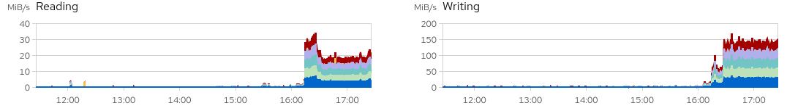

# Admin Experiments

Untarring a 650 GB file on Penelope produces the following system usage:

So the write I/O is 150 MB/S. But essentially no CPU or RAM  (<5%) is used.

Compaing against our Toshiba MG08 drives, which have these specs:

| Available Capacities                                      | 16 TB, 14 TB                                  |
| --------------------------------------------------------- | --------------------------------------------- |
| Form Factor                                               | 3.5-inch                                      |
| Buffer Size                                               | 512 MiB                                       |
| Rotation Speed                                            | 7200rpm                                       |
| Maximum Data Transper Speed             (Sustained)(Typ.) | 16 TB: 262 MiB/s             14 TB: 248 MiB/s |
| Power Consumption             ( Idle - A )                | SATA: 4.00W             SAS: 4.46W            |
| MTTF/MTBF                                                 | 2 500 000 h                                   |
| Weight ( Max )                                            | 720g                                          |

Thus we're using ~60% of our max transfer speed? Do we have to include Read and Write? How does Raid6 config affect this?

## Untarring a 650 GB file took the following time:
628GiB 8:13:34 [21.7MiB/s]
