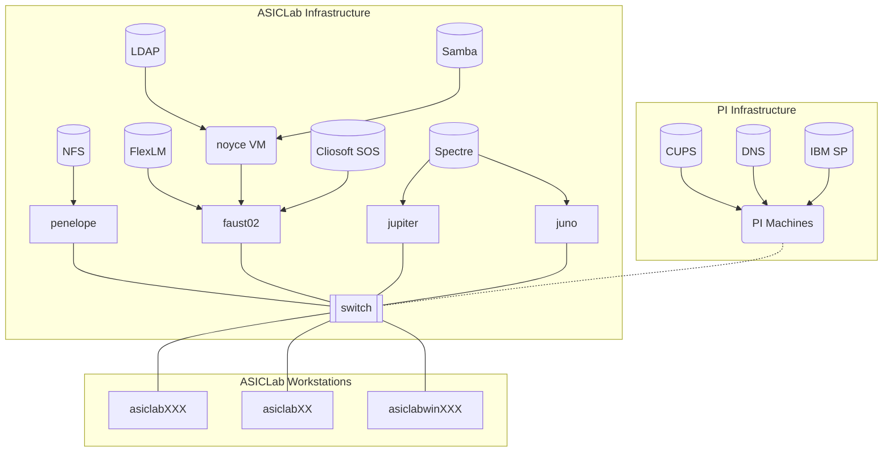

## Overview

The documentation covers ASICLab software, servers, workstations, and other infrastructure. The scope of this document is information that a user with basic familiarity with Linux systems would need to fix problems with existing systems or add new systems to the network. Therefore, extensive documentation of general Linux knowledge should be avoided to avoid diluting the usefulness of information.

## Network Architecture

The follow diagram shows the various workstations and servers (i.e. infrastructure used in the lab, and the major services that run on the servers like NFS and LDAP. Additionally, some useful services like DNS and CUPS are inherited from the larger PI network, as seen on the right.




## List of Machines and their Purpose

`asiclab###`: User Workstations

`aisclabwin###`: User Windows Machines

`penelope`: NFS, LDAP, License Servers

`jupiter`: Simulation server

`juno`: Simulation server (identical configuration of jupiter)

`faust02`: (soon to be decommissioned, still running LDAP and License Server)

`apollo`: (retired)

`asiclab##`: Retired user workstations, still good for less demanding work. Easily configured for Linux or Windows.

## Workstation Setup for Fedora Linux

Start here to configure a fresh installation of Fedora Linux (>=37) on a lab desktop workstation.

1. Create a bootable USB drive with the latest version of Fedora Workstation. The easiest way to do this is on Fedora, MacOS, or Windows using the [Fedora Media Writer](https://getfedora.org/en/workstation/download/). Alternatively, download the latest Fedora ISO file, check the name of your drive with `sudo fdisk -l`, unmount the drive with `sudo umount /dev/sdb*`, and write the ISO image to the drive with `sudo dd bs=4M if=/path/to/fedora.iso of=/dev/sdb status=progress oflag=sync`. Wait for the writing to complete, which could take several minutes.

1. Before flashing Fedora, boot into the BIOS. Reset all settings to 'BIOS Default', then change the Wake on LAN setting to "Enabled with PXE", and change the system setting time to at least the correct hour. Also, be sure that the boost disk mode is set to "AHCI" rather than "Raid on".

1. Insert the bootable USB drive into the machine to be configured and change the boot order in the BIOS or UEFI to boot from the USB drive first. Reboot the machine.

1. Once the Fedora installer has loaded, select "Install to Hard Drive", choose your desired region and keyboard setup, and select the machine's solid state drive for install. After install has completed and the computer has rebooted, accept the prompt to opt into 'Third Party Repositories', and create a local user account called `asiclab`. Ask one of the older lab members for the default admin password for this account. (Password updated as of April 2023.) You should now be on the desktop.

1. [Verify network settings](network_configuration.md), including IP address and hostname, have been properly adopted from the department DNS server. `ping www.google.com` to make sure you have internet! Then turn on SSH in settings via  `Settings > Sharing > Enable Sharing > Enable Remote Login`.

   **From here forward, remote config management is possible. See [Ansible notes](ansible.md) for more info.**

1. Check for and install any packages updates with `sudo dnf update` and `sudo dnf clean packages`.

   Especially important are security updates and firmware upgrades.

1. [Connect to the NFS file server](file_server.md) providing user directories, EDA tools, and process design kits. This is necessary so that home directories exist.

   ```
   $ cd /
   $ sudo mkdir users
   $ sudo mkdir tools
   
   $ sudo vim /etc/fstab
   penelope.physik.uni-bonn.de:/export/disk/users /users nfs4 defaults 0 0
   penelope.physik.uni-bonn.de:/export/disk/tools /tools nfs4 ro 0 0
   ```

   Reboot to mount.

1. [Connect to the FreeIPA integrated LDAP directory server](user_management.md) to read user accounts and group settings. 

   ```bash
   sudo realm join asiclabwin001.physik.uni-bonn.de -v
   ```

   In this process, authenticate as `admin` account. This will create remote LDAP+NFS users, plus a local LDAP only lab user, with /home/ director

1. [Setup the printers!](printer_config.md)

1. Follow instructions for running containerized Cadence, if you need it, using `apptainer`.

1. Finally, enable 3rd party repos (if not already done), and follow instruction to install proprietary software, like Slack, Chrome, etc.

1. If you plan to work remotely, read the section on Remote Connection, which covers SSH, VNC, Wireguard (in network-manager interface)
