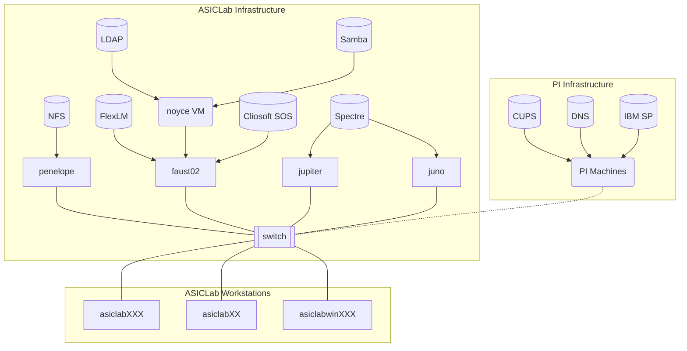

# Overview

The documentation covers ASICLab software, servers, workstations, and other infrastructure. The scope of this document is information that a user with basic familiarity with Linux systems would need to fix problems with existing systems or add new systems to the network. Therefore, extensive documentation of general Linux knowledge should be avoided to avoid diluting the usefulness of information.

# Network Architecture

The follow diagram shows the various workstations and servers (i.e. infrastructure used in the lab, and the major services that run on the servers like NFS and LDAP. Additionally, some useful services like DNS and CUPS are inherited from the larger PI network, as seen on the right.



## Machine purposes

`asiclab###`: User Workstations

`aisclabwin###`: User Windows Machines

`penelope`: NFS, LDAP, License Servers

`jupiter`: Simulation server

`juno`: Simulation server (identical configuration of jupiter)

`faust02`: (soon to be decommissioned, still running LDAP and License Server)

`apollo`: (retired)

`asiclab##`: Retired user workstations, still good for less demanding work. Easily configured for Linux or Windows.

# Tasks
- [ ] sosmgr/sosadmin server re-setup
- [ ] test fscache + NFS setup to see if it offers read speed benefits
- [ ] migrate FreeIPA LDAP server to penelope
- [ ] finish migrating remaining machines to AlmaLinux 9
- [ ] check licenses are up to date
- [ ] understand all the SELinux alerts
- [ ] update to synopsys 2023-24 tools
- [ ] update TSMC 28nm Design rule manual & DRC deck 2.1 -> 2.2. [See](https://asic-support-28.web.cern.ch/tech-docs/drc-decks/)
- [ ] port bonding on servers `penelope`, etc?
- [ ] test penelope NFS backups IBM Tivoli Spectrum
- [ ] update siemens questa to 2023-24 release?
- [x] What is `amslmd`. Delete please.


# Changelog
 
Cliosoft version 7.20 recommended April 24


- Installed version 1.0 of 28nm CERN PDK
- 


- Installed version V1.7A_1 65nm PDK into fresh `/tools/kits/TSMC/65LP/

```
TSMC65_CERN_V1.7A_1_pre8.0_2017_PDKs_1p6_1p7_1p9.tar.gz
TSMC65_CERN_V1.7A_1_pre8.0_2017_digital_IO.tar.gz
TSMC65_CERN_V1.7A_1_pre8.0_2017_digital9t.tar.gz
TSMC65_CERN_V1.7A_1_pre8.0_2017_digital7t.tar.gz
TSMC65_CERN_V1.7A_1_pre8.0_2017_digital12t.tar.gz
```


Jul 2023 28nm PDK version 1.1

Jan 2024 28nm DRC version 2.2

Feb 2024 Synopsys 2024-24

Feb 2024 65nm DRC version 2.6_2a