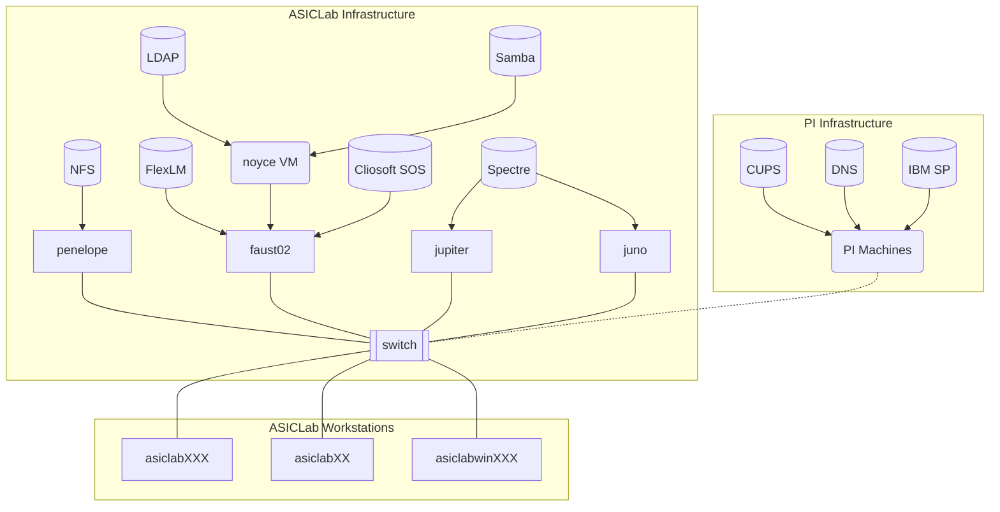

## Table of Contents
- Boot sequence
- 


- Servers
  - Machine Setups
 
  - NFS server
  - 

- Workstations
  -  


- Software
  - Hdl21
  - Laygo2
  - BAG3++

- Tools
  - ssh
  - tmux
  - python, venv, imports, etc
  - git
  - gcc, cmake, make, pybind, c, c++
  - bash
  - pandoc

## Overview

The documentation covers ASICLab software, servers, workstations, and other infrastructure. The scope of this document is information that a user with basic familiarity with Linux systems would need to fix problems with existing systems or add new systems to the network. Therefore, extensive documentation of general Linux knowledge should be avoided to avoid diluting the usefulness of information.

## Network Architecture

The follow diagram shows the various workstations and servers (i.e. infrastructure used in the lab, and the major services that run on the servers like NFS and LDAP. Additionally, some useful services like DNS and CUPS are inherited from the larger PI network, as seen on the right.




## List of Machines and their Purpose

`asiclab###`: User Workstations

`aisclabwin###`: User Windows Machines

`penelope`: NFS, LDAP, License Servers

`jupiter`: Simulation server

`juno`: Simulation server (identical configuration of jupiter)

`faust02`: (soon to be decommissioned, still running LDAP and License Server)

`apollo`: (retired)

`asiclab##`: Retired user workstations, still good for less demanding work. Easily configured for Linux or Windows.


- `/startup_scripts`: Startups scripts for ASIC, FPAGa, and TCAD tools

## Create bootable ISO

Download ISO file:

```
curl -O https://repo.almalinux.org/almalinux/9/isos/x86_64/AlmaLinux-9.1-x86_64-dvd.iso
```


Insert your target USB and locate it. There are different ways to do it, but here are some of them:

- `sudo fdisk -l`  - this command shows you the connected block storage devices, including the USB devices.
- `lsblk` - this command gives you all the availabzle block storage devices, including the USB block storage devices.
- `sudo blkid` - this command gives you the same information as `lsblk`, but you have to run it as root.

You need to look for /dev/sda or /dev/sdb or /dev/sdc, which is your target USB.

After you found out the location of your target USB, navigate to the location of your source ISO. Run the dd command to copy files from ISO to USB:

```text
sudo dd if=./AlmaLinux-9.1-x86_64-dvd.iso of=/dev/sdX status=progress
```

This command also works:

```
sudo sh -c 'cat ./AlmaLinux-9.2-x86_64-dvd.iso > /dev/sdb; sync'
```

## BIOS Settings:

Pres Fn + F2 to reach BIOS settings

Reset BIOS settings to default.
- General > Boot Sequence > Clear Full List, leaving only thumb drive
- General > Advanced Boot Options > Enable Legacy Options ROMs > Disabled
- System Configuration > SATA Operation > AHCI
- Power Management > Deep Sleep Control > Disabled
- Power Management > Wake on LAN/WLAN > LAN Only (
      - Only form states S4 = Hibernate and S5 = Power Off; standby and sleep on are lighter and constrolled at the OS level
      - More info on these states can be found [here](https://en.wikipedia.org/wiki/ACPI#Global_states)

Apply, exit, reboot. Then press Fn + F12 to Reach "One Time Boot Menu". Select UEFI -> USB Drive.

## Anaconda Install Menu

1. Set keyboard to English (US), add German as a secondary option.
2. *Root Password* should be "Disabled"
3. Create user `asiclab` with `uid = 1000` and `gid = 1000`. Make user an administrator.
4. *Installation source* is local media.
5. *Software Selection* should be "Server with GUI"
6. For the installation destination, select both the NVME and HDD and select 'custome' for the storage configuration. Use traditional partitioning (no LVM) and configure the disks like below. Use `ext4` for the filesystems on the `/tmp` and `/` partitions. The swap is swap, and the efi is a EFI boot partition.

```
NAME        MAJ:MIN RM   SIZE RO TYPE MOUNTPOINTS
nvme0n1     259:0    0 238.5G  0 disk 
├─nvme0n1p1 259:1    0   600M  0 part /boot/efi
├─nvme0n1p2 259:2    0  1024M  0 part /boot
├─nvme0n1p3 259:3    0   200G  0 part /
└─nvme0n1p4 259:4    0    32G  0 part [SWAP]
sda           8:0    0  1.82T  0 disk 
└─sda1        8:1    0  1.82T  0 part /tmp
```

7. Make sure ethernet is connected. 


## Basic

Once booting into Alma Linux, follow the basic steps below to update firmware, update core packages, and connect to NFS, LDAP/FreeIPA, and printers.

1. Update firmware, in four commands

```
sudo fwupdmgr enable-remote lvfs
sudo fwupdmgr refresh
sudo fwupdmgr get-updates
sudo fwupdmgr update
```

Afterwards, you can check firmware version with `hostnamectl`.

1. Initial check for/install core packages updates:

```
sudo dnf clean all
sudo dnf update
```

1. [Connect to the NFS file server](file_server.md) providing user directories, EDA tools, and process design kits. This is necessary so that home directories exist.

Create mount points
```
sudo mkdir /users
sudo mkdir /tools
```

Append mount instructions to the end of `/etc/fstab`, using these hand commands:

```
echo 'penelope.physik.uni-bonn.de:/export/disk/users /users nfs4 defaults 0 0' | sudo tee --append /etc/fstab
```

```
echo 'penelope.physik.uni-bonn.de:/export/disk/tools /tools nfs4 ro 0 0' | sudo tee --append /etc/fstab
```

Check the commands are there only once:

```
sudo cat /etc/fstab
```

Make sure that the machine can mount NFS4 shares:

```
ls -l /sbin/mount*
```

If not, then install:

```
sudo dnf install nfsv4-client-utils
```

And for useful commands like `showmount`:

```
sudo dnf groupinstall "Network File System Client"
```

Report status of current NFS4 mounts on client:

```
mount -l -t nfs4
```

Ping remote host from client, to see connection options:

```
showmount -e penelope.physik.uni-bonn.de
```

Mount remote NFS shares
```
sudo systemctl daemon-reload
sudo mount -a
```

[Connect to the FreeIPA integrated LDAP directory server](user_management.md) to read user accounts and group settings. 

```
sudo realm join asiclabwin001.physik.uni-bonn.de -v
```

In this process, authenticate as `admin` account. This will create remote LDAP+NFS users. The changes made are summarized in the script output:

```
 * Resolving: _ldap._tcp.asiclabwin001.physik.uni-bonn.de
 * Resolving: asiclabwin001.physik.uni-bonn.de
 * Performing LDAP DSE lookup on: 131.220.164.69
 * Successfully discovered: physik.uni-bonn.de
Password for admin: 
 * Couldn't find file: /usr/sbin/ipa-client-install
 * Required files: /usr/sbin/ipa-client-install, /usr/sbin/oddjobd, /usr/libexec/oddjob/mkhomedir, /usr/sbin/sssd
 * Resolving required packages
 * Installing necessary packages: ipa-client oddjob oddjob-mkhomedir
 * LANG=C /usr/sbin/ipa-client-install --domain physik.uni-bonn.de --realm PHYSIK.UNI-BONN.DE --mkhomedir --enable-dns-updates --unattended --force-join --server asiclabwin001.physik.uni-bonn.de --fixed-primary --principal admin -W --force-ntpd
Option --force-ntpd has been deprecated and will be removed in a future release.
Client hostname: juno.physik.uni-bonn.de
Realm: PHYSIK.UNI-BONN.DE
DNS Domain: physik.uni-bonn.de
IPA Server: asiclabwin001.physik.uni-bonn.de
BaseDN: dc=physik,dc=uni-bonn,dc=de
Synchronizing time
No SRV records of NTP servers found and no NTP server or pool address was provided.
Attempting to sync time with chronyc.
Time synchronization was successful.
Successfully retrieved CA cert
    Subject:     CN=Certificate Authority,O=PHYSIK.UNI-BONN.DE
    Issuer:      CN=Certificate Authority,O=PHYSIK.UNI-BONN.DE
    Valid From:  2023-04-26 15:13:16
    Valid Until: 2043-04-26 15:13:16

Enrolled in IPA realm PHYSIK.UNI-BONN.DE
Created /etc/ipa/default.conf
Configured /etc/sssd/sssd.conf
Systemwide CA database updated.
Failed to update DNS records.
Adding SSH public key from /etc/ssh/ssh_host_ed25519_key.pub
Adding SSH public key from /etc/ssh/ssh_host_rsa_key.pub
Adding SSH public key from /etc/ssh/ssh_host_ecdsa_key.pub
Could not update DNS SSHFP records.
SSSD enabled
Configured /etc/openldap/ldap.conf
Configured /etc/ssh/ssh_config
Configured /etc/ssh/sshd_config.d/04-ipa.conf
Configuring physik.uni-bonn.de as NIS domain.
Configured /etc/krb5.conf for IPA realm PHYSIK.UNI-BONN.DE
Client configuration complete.
The ipa-client-install command was successful
This program will set up IPA client.
Version 4.10.2


Using default chrony configuration.
 * /usr/bin/systemctl enable sssd.service
 * /usr/bin/systemctl restart sssd.service
 * Successfully enrolled machine in realm
```


Check it worked, by pinging one of the user accounts:

```
id kcaisley
```

To configure a machine's CUPS client to connect to the PI printer server (`cups.physik.uni-bonn.de`), check for and edit `/etc/cups/client.conf` file:

```
cat /etc/cups/client.conf
```

If not found:
```
sudo touch /etc/cups/client.conf
```

And then append the server name to the file, so that is contains the line. Be sure to check with `cat`:

```
echo 'ServerName cups.physik.uni-bonn.de' | sudo tee --append /etc/cups/client.conf
```

All printers on the FTD network should now be available. To check, you can view a summary of available network printers with the following command:

```
lpstat -t
```

1. Report GPU info

```
sudo lshw -C display
```


## Network config

Perhaps consider copying static hostname file to machines?


## System tools, dev tools, and extra repos:

Perhaps consider: 

Providing: nmap tmux zsh tigervnc, etc.... hmm no I don't want tigervnc or zsh
```
sudo dnf groupinstall "System Tools"
```

Providing: gcc gcc-c++ make cmake git, and many rpm tools
```
sudo dnf groupinstall --with-optional "Development Tools"
```

For python and venv:

```
sudo dnf install python3-devel python3-pip
```

Install the extra repos, including 'power tools repo', also called CRB

```
sudo dnf install epel-release
sudo dnf install elrepo-release
sudo dnf config-manager --set-enabled crb

sudo dnf clean all
sudo dnf update
```


## EDA Tool specific setup

```
sudo dnf install -y csh tcsh glibc elfutils-libelf ksh mesa-libGL mesa-libGLU motif libXp libpng libjpeg-turbo expat glibc-devel gdb libXScrnSaver xorg-x11-fonts-misc xorg-x11-fonts-ISO8859-1-75dpi apr apr-util xorg-x11-server-Xvfb mesa-dri-drivers openssl-devel
```

For IC617 and before, you need 32 bit package versions:

```
sudo dnf install -y glibc.i686 elfutils-libelf.i686 mesa-libGL.i686 mesa-libGLU.i686 motif.i686 libXp.i686 libpng.i686 libjpeg-turbo.i686 expat.i686 glibc-devel.i686 redhat-lsb.i686  
```

```
yum provides '*/libnsl.so.1'
Last metadata expiration check: 0:11:02 ago on Sat 09 Sep 2023 02:23:52 PM CEST.
libnsl-2.34-60.el9.i686 : Legacy support library for NIS
Repo        : baseos
Matched from:
Filename    : /lib/libnsl.so.1

libnsl-2.34-60.el9.x86_64 : Legacy support library for NIS
Repo        : baseos
Matched from:
Filename    : /lib64/libnsl.so.1

sudo dnf install libnsl-2.34-60.el9.x86_64
```

When trying to get this same compat-db47 from above:

```
Repository 'epel-9-x86_64' does not exist in project 'mlampe/compat-db47'.
Available repositories: 'epel-8-x86_64'

If you want to enable a non-default repository, use the following command:
  'dnf copr enable mlampe/compat-db47 <repository>'
But note that the installed repo file will likely need a manual modification.
[asiclab@asiclab003 kcaisley]$ sudo dnf copr enable mlampe/compat-db47 epel-8-x86_64
```


`lsb_release` doesn't seem to exist on RHEL9: https://www.reddit.com/r/RockyLinux/comments/wjlh0s/need_to_install_redhatlsbcore_on_rocky_linux_9/. Except, at the bottom someone says it's now in the AlmaLinux Devel repo:

https://almalinux.pkgs.org/9/almalinux-devel-x86_64/redhat-lsb-core-4.1-56.el9.x86_64.rpm.html

`sudo dnf config-manager --add-repo https://repo.almalinux.org/almalinux/9/devel/almalinux-devel.repo`

`sudo dnf --enablerepo=devel install redhat-lsb-core`
`udo dnf config-manager --set-disabled copr:copr.fedorainfracloud.org:mlampe:compat-db47`

Then make sure that devel is disabled with `sudo dnf config-manager --set-disabled devel`
and then `dnf repolist`, shouldn't show devel


libcrypto.so.10 doesn't also exist. Manually downloaded and installed the version from EL8: https://almalinux.pkgs.org/8/almalinux-appstream-x86_64/compat-openssl10-1.0.2o-4.el8_6.x86_64.rpm.html

`wget https://repo.almalinux.org/almalinux/8/AppStream/x86_64/os/Packages/compat-openssl10-1.0.2o-4.el8_6.x86_64.rpm`

Then just `rpm -i package-name`


Based on this link, learned I have /lib64/libdl.so.2 but Virtuoso is looking for /lib64/libdl.so. So just created a symlink:

```
sudo ln -s /lib64/libdl.so.2 /lib64/libdl.so
```

Lastly, for virtuoso, we can see this symlink:

```
ls -la /etc/redhat-release 
lrwxrwxrwx. 1 root root 17 May 16 15:34 redhat-release -> almalinux-release
```

Remove the link, and recreate it as a files, and put the following text inside:
```
sudo rm /etc/redhat-release
sudo touch /etc/redhat-release
echo 'Red Hat Enterprise Linux Server release 7.9 (Maipo)' | sudo tee --append /etc/redhat-release
```

*Virtusos now works!*

## Continuing on Alma Linux 9:

sudo dnf install tmux htop pandoc curl wget git gcc cmake g++ python3-devel python3-pip
sudo dnf install libreoffice-impress libreoffice-calc libreoffice-writer libreoffice-calc inkscape


# Installing Vivado:
Needed libtinfo.5, but had libtinfo.6, so just installed a comptability package to provide the older version in addition:

```
sudo dnf install ncurses-compat-libs
```

```
sudo dnf install fxload libusb1 libusb1-devel libusb
sudo udevadm control --reload-rules
```

# Setting up TCAD

```
sudo dnf install ksh perl perl-core tcsh strace valgrind gdb bc xorg-x11-server-Xvfb gcc glibc-devel bzip2 ncompress
```

Jedit is needed for editing scripts, read about it here:
http://www.jedit.org/index.php?page=download&platform=windows

Java Runtime version 1.8 (aka Java 8) or later is required for jEdit 5.4 and later.
Java Runtime version 11 (aka Java 11) or later is required for jEdit 5.6 and later.
Sentarus provides jedit5.6, Java has to be version 11, and AlmaLinux 9 has version 8.

To fix this, install and enable Java 11:

```
sudo dnf install java-11-openjdk
sudo alternatives --config java
```

Then lastly, while logged in graphically on the machines, do the following: 

```
sudo java -jar jedit5.6.0install.jar
```

This will provide jedit which can be launched from inside TCAD as the default editor.
